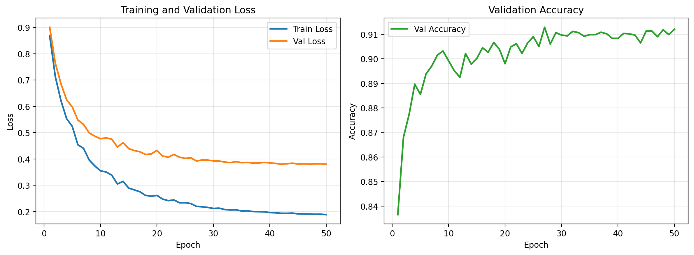
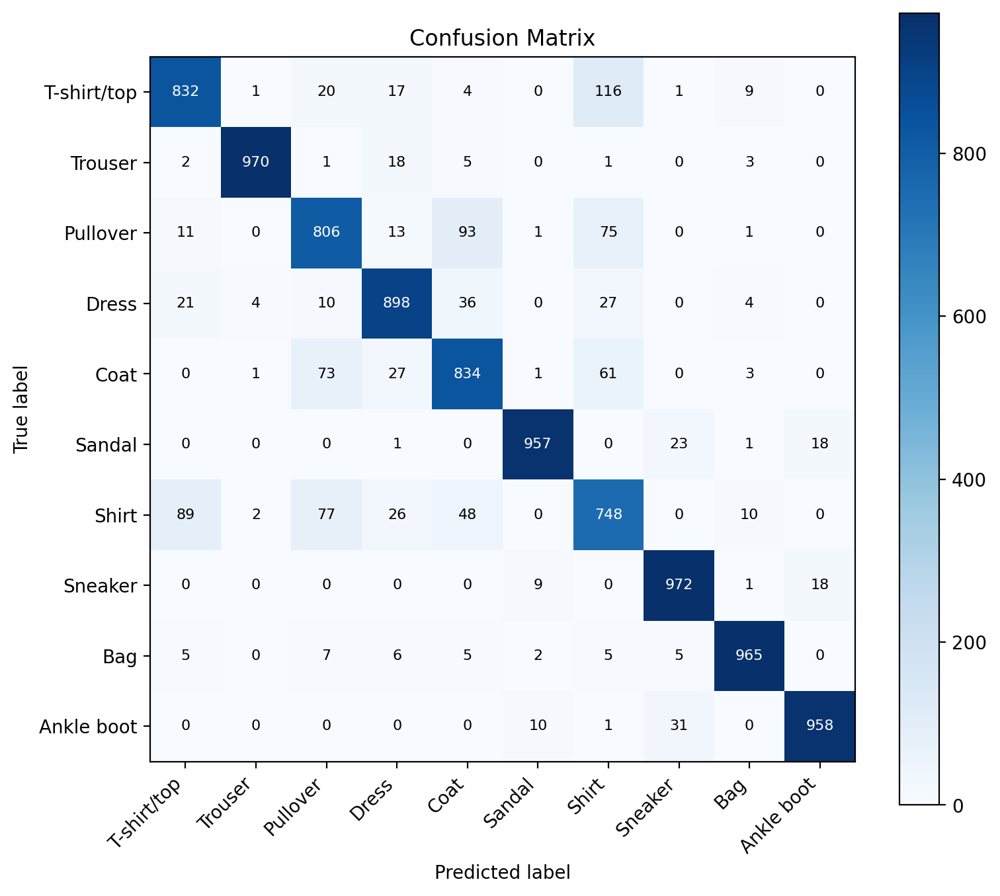
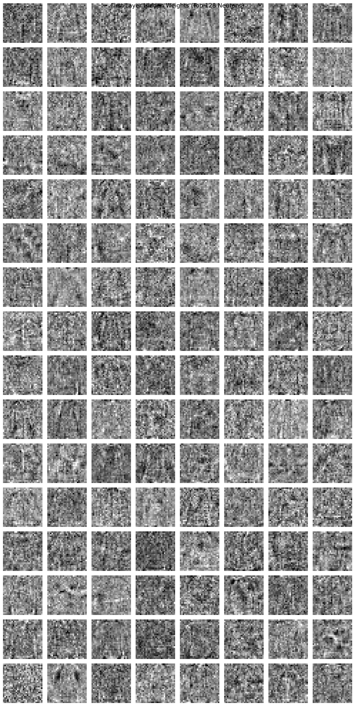
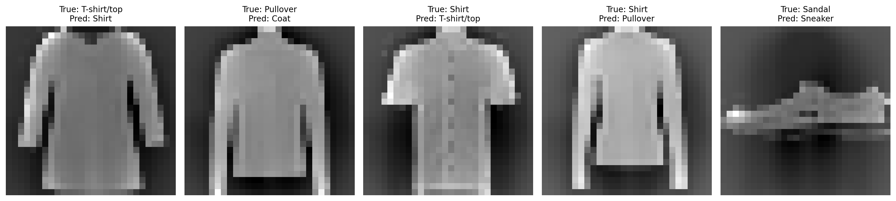

# Fashion-MNIST 实验报告
- GitHub Repo: [请替换为你的公开 GitHub 仓库链接]
- 模型权重下载地址: [请替换为你的 Google Drive 或其他下载链接]
## 1. 实验任务

本实验使用 `NumPy` 从零实现一个单隐藏层多层感知机（MLP），在 `Fashion-MNIST` 数据集上完成 10 类服装图像分类任务。实验内容包括模型训练、超参数搜索、测试集评估、训练曲线可视化、第一层权重可视化以及错例分析。

## 2. 数据集与预处理

### 2.1 数据集介绍

`Fashion-MNIST` 是一个常用的服装分类数据集，共包含 10 个类别：

- T-shirt/top
- Trouser
- Pullover
- Dress
- Coat
- Sandal
- Shirt
- Sneaker
- Bag
- Ankle boot

数据集规模如下：

- 训练集：60,000 张图像
- 测试集：10,000 张图像
- 图像尺寸：`28 × 28`
- 图像类型：灰度图像

### 2.2 数据预处理

在本实验中，输入图像首先被展开为 `784` 维向量，然后进行如下预处理：

1. 将像素值归一化到 `[0, 1]`
2. 使用训练集的像素均值和标准差对输入做标准化
3. 从训练集中划分出验证集，用于模型选择与超参数搜索

这样可以减小不同像素维度之间的尺度差异，使训练过程更加稳定。

## 3. 模型结构

本实验实现的是一个单隐藏层 MLP，模型结构如下：

- 输入层维度：`784`
- 隐藏层维度：`512`
- 输出层维度：`10`
- 激活函数：`ReLU`

模型训练设置如下：

- 优化方法：`SGD`
- 损失函数：交叉熵损失
- 学习率衰减：使用 `lr_decay`
- 正则化：`L2 weight decay`

最终选定的最优超参数为：

- `hidden_dim = 512`
- `activation = relu`
- `lr = 0.2`
- `lr_decay = 0.95`
- `weight_decay = 0.001`
- `epochs = 50`

验证集最佳准确率为：

- `best validation accuracy = 0.9128`

## 4. 超参数搜索结果概述

本实验对以下超参数进行了网格搜索：

- `hidden_dim ∈ {128, 256, 512, 768}`
- `activation ∈ {relu, tanh, sigmoid}`
- `lr ∈ {0.2, 0.1, 0.05, 0.01}`
- `lr_decay ∈ {1.0, 0.98, 0.95, 0.9}`
- `weight_decay ∈ {0, 1e-5, 1e-4, 1e-3}`
- `epochs = 50`

理论总组合数为：

`4 × 3 × 4 × 4 × 4 = 768`

综合全部实验结果可以得到以下规律：

- `ReLU` 的整体效果最好，平均性能和最优性能都优于 `tanh` 和 `sigmoid`
- 较大的隐藏层维度通常更有效，其中 `512` 和 `768` 表现最好
- 较大的学习率 `0.2` 更有利于模型收敛
- `lr_decay = 0.95` 能取得最佳单次结果
- `weight_decay = 0.001` 有助于获得更高的验证集上限

## 5. 训练过程可视化

按照作业要求，需要可视化：

- 训练集上的 Loss 曲线
- 验证集上的 Loss 曲线
- 验证集上的 Accuracy 曲线

下图展示了最优超参数配置下，完整 `50` 个 epoch 的训练过程。

### 5.1 曲线分析

从曲线中可以观察到：

- 训练集 Loss 随着 epoch 增加持续下降
- 验证集 Loss 整体也在下降，并在后期趋于平稳
- 验证集 Accuracy 整体持续上升，在后期稳定在较高水平

这说明：

- 当前超参数配置可以使模型稳定收敛
- 学习率衰减策略是有效的
- 模型在训练后期没有出现明显的发散现象

此外，本次训练共进行了 `50` 个 epoch，其中最佳验证集准确率出现在第 `27` 个 epoch 左右，说明模型在中后期已经基本收敛，后续 epoch 的提升空间较小，但仍有助于保持训练稳定。

## 6. 测试集结果

使用最优超参数训练得到的最佳模型，在测试集上的结果如下：

- `test loss = 0.4414`
- `test accuracy = 0.8940`

该结果说明，虽然模型结构较为简单，只使用了单隐藏层全连接网络，但仍然能够在 `Fashion-MNIST` 上取得较好的分类效果。

## 7. 混淆矩阵分析

测试集上的混淆矩阵如下图所示：

从混淆矩阵中可以观察到：

- `Trouser`、`Sneaker`、`Bag`、`Ankle boot` 等类别识别效果较好
- `Shirt`、`Pullover`、`Coat` 等类别之间更容易发生混淆

这说明模型对轮廓明显、形状差异较大的类别区分能力较强，而对外观相近的上衣类服装区分能力相对较弱。

## 8. 第一层权重可视化与空间模式观察

为了观察网络在第一层学到了什么特征，将第一层隐藏层权重矩阵恢复为 `28 × 28` 图像并进行可视化，结果如下：

从图中可以看到：

- 一部分神经元学习到了明显的水平边缘和竖直边缘
- 一部分神经元对斜边、局部轮廓和区域亮暗分布更加敏感
- 某些权重模式类似服装外轮廓、鞋底结构或衣服中部区域响应

这说明即使是简单的全连接网络，第一层仍然能够学到一些与服装类别相关的低层视觉模式，例如：

- 边缘
- 方向纹理
- 局部形状
- 粗粒度空间分布

这些低层模式会被后续层进一步组合，用于完成最终分类。

## 9. 错例分析

测试集中的错误主要集中在外观比较相似的类别之间。下面给出若干典型错例：

本实验中选取的典型错分包括：

- `T-shirt/top` 被分为 `Shirt`
- `Pullover` 被分为 `Coat`
- `Shirt` 被分为 `T-shirt/top`
- `Shirt` 被分为 `Pullover`
- `Sandal` 被分为 `Sneaker`

这些错分的原因主要包括：

1. `T-shirt/top`、`Shirt`、`Pullover`、`Coat` 在低分辨率灰度图中轮廓差异较小
2. 领口、袖长、面料等关键区别在 `28 × 28` 图像中难以充分保留
3. MLP 使用的是展开后的向量输入，对局部空间结构建模能力有限
4. 鞋类在某些样本中只保留了局部轮廓，容易因鞋底或整体形状接近而混淆

因此，当前模型更依赖整体轮廓与粗粒度形状信息，而对局部空间细节的利用能力较弱。

## 10. 结论

本实验基于 `NumPy` 从零实现了一个单隐藏层 MLP，并在 `Fashion-MNIST` 数据集上完成了分类任务。通过系统的超参数搜索，最终选择了如下最优配置：

- `hidden_dim=512`
- `activation=relu`
- `lr=0.2`
- `lr_decay=0.95`
- `weight_decay=0.001`
- `epochs=50`

在该配置下，模型取得了：

- 验证集最佳准确率：`0.9128`
- 测试集准确率：`0.8940`

实验结果表明：

- `ReLU` 更适合该任务
- 较大的隐藏层维度能够提升模型性能
- 较大的学习率配合适当衰减可以获得更好的优化效果
- 第一层权重已经能够学习到明显的边缘和轮廓模式
- 错误主要来自外观相近类别之间的混淆

整体来看，该 MLP 模型已经能够较好地完成 `Fashion-MNIST` 分类任务，但由于缺乏对局部空间结构的专门建模能力，在细粒度相似类别上的表现仍然有限。

